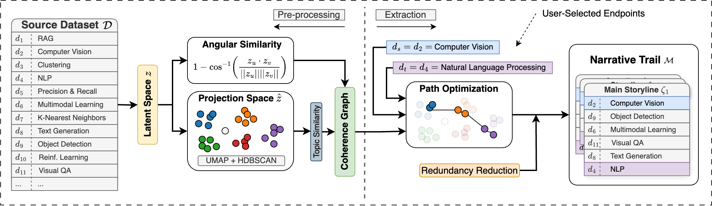

# Narrative Trails
A Method for Coherent Storyline Extraction via Maximum Capacity Path Optimization



Narrative Trails is an embedding-based framework for extracting coherent storylines from large document datasets. Unlike traditional information retrieval, which retrieves documents without a pre-defined structure, Narrative Trails structures information into ordered narratives that maximize semantic coherence between documents. This makes it easier for people to identify underlying patterns, connections, and themes that might not be immediately evident by the data.

## Installation
```bash
git clone https://github.com/faustogerman/narrative-trails.git
cd narrative-trails
pip install -r requirements.txt
```
Note: We recommend using a dedicated Conda environment to install and execute this project.

#### OpenAI API
To re-extract embeddings or use your own dataset, create a `.env` file at the root of the project and add an `OPENAI_API_KEY` entry with your OpenAI key to make API calls for embedding extraction. 

However, we already provide embeddings for our evaluation datasets in the `./data` folder. Therefore, you can run this project and reproduce our results without an API key by simply commenting out the following line in `./Library/embedding_extraction.py`:

```python
client = OpenAI(api_key=os.getenv("OPENAI_API_KEY"))
```

## Usage
After cloning the repository and installing the dependencies from `requirements.txt` open and run any `.ipynb` file to reproduce our results. Example Jupyter notebooks for the News Articles and VisPub datasets are available in the [./Examples](./Examples/) folder with details about parameters and redundancy reduction.

NOTE: Expect the results to be slightly different from ours, since each installation of UMAP and HDSCAN can lead to different initial random states, producing different low-dimensional projections.

## Example Storylines
Below are example narratives extracted using the Narrative Trails algorithm.

**Example \#1 – Narrative About the First COVID 19 Death and Airlines Suspending Flights to China**
```
idx    Topic   Date             title
----------------------------------------------------------------
85     0       Jan 10, 2020     China reports first death from mysterious outbreak in Wuhan
86     0       Jan 15, 2020     Japan confirms first case of coronavirus infection
87     0       Jan 17, 2020     Coronavirus: more cases and second death reported in China
98     0       Jan 23, 2020     China coronavirus: Lockdown measures rise across Hubei province
102    0       Jan 24, 2020     China expands coronavirus outbreak lockdown to 56 million people
114    0       Jan 29, 2020     Airlines around the world are suspending flights to China as the coronavirus spreads
```

**Example \#2 – Narrative About the 2021 Cuban Protests and Political Reactions in the U.S.** 
```
idx    Topic   Date             title
----------------------------------------------------------------
185    16      Jul 12, 2021     Cuba: Thousands Nationwide Take Streets Against Communism
205    15      Jul 12, 2021     Police patrol Havana in large numbers after rare protests
184    15      Jul 12, 2021     Cuba blames US, social media for uprising against Communist regime
189    11      Jul 12, 2021     Cuba arrests activists as government blames unrest on U.S. interference
203    11      Jul 12, 2021     Cuban government aggressively suppresses protests
215    12      Jul 12, 2021     Cuban Americans in Miami warn China-Russia intervention could cause 'bloodbath' in Cuba
180    12      Jul 12, 2021     Biden Administration Claims Cuban Anti-Communist Protests Are About 'Rising COVID Cases/Deaths'
204    12      Jul 12, 2021     Democrats and Republicans divided on Cuban protest response
206    12      Jul 12, 2021     Rubio slams Biden admin's 'major failure' of initially tying of Cuban protests to rising COVID cases
259    12      Jul 14, 2021     Rubio: Cuba will see 'horrific bloodbath' if Biden does not take action
445    12      Jul 26, 2021     Protests break out in front of WH urging Biden to take firmer stance on Cuba
```

**Example \#3 – Narrative About the Evolution of Visualization Techniques in Data Science** 
```
idx    Topic   Date             Title
----------------------------------------------------------------
129    51      Jan 01, 2021     M2Lens: Visualizing and Explaining Multimodal Models for Sentiment Analysis
75     45      Jan 01, 2022     Diverse Interaction Recommendation for Public Users Exploring Multi-view Visualization using Deep Learning
66     36      Jan 01, 2022     MEDLEY: Intent-based Recommendations to Support Dashboard Composition
70     20      Jan 01, 2022     Effects of View Layout on Situated Analytics for Multiple-View Representations in Immersive Visualization
1953   36      Jan 01, 2007     ManyEyes: a Site for Visualization at Internet Scale
3351   36      Jan 01, 1993     Bridging the gap between visualization and data management: A simple visualization management system
2265   34      Jan 01, 2005     Distributed data management for large volume visualization
3308   38      Jan 01, 1994     A case study on visualization for boundary value problems
3537   33      Jan 01, 1990     Visualization for nonlinear engineering FEM analysis in manufacturing
2568   42      Jan 01, 2003     IEEE Visualization 2003 (IEEE Cat. No.03CH37496)
581    29      Jan 01, 2018     Dynamic Volume Lines: Visual Comparison of 3D Volumes through Space-filling Curves
864    56      Jan 01, 2016     Visualizing Shape Deformations with Variation of Geometric Spectrum
65     29      Jan 01, 2022     Level Set Restricted Voronoi Tessellation for Large scale Spatial Statistical Analysis
1386   30      Jan 01, 2012     Surface-Based Structure Analysis and Visualization for Multifield Time-Varying Datasets
984    30      Jan 01, 2015     Interactive Visualization for Singular Fibers of Functions f : R3 → R2
1301   30      Jan 01, 2012     Generalized Topological Simplification of Scalar fields on Surfaces
1097   30      Jan 01, 2014     Multiscale Symmetry Detection in Scalar Fields by Clustering Contours
926    48      Jan 01, 2015     Comparative visual analysis of vector field ensembles
1930   48      Jan 01, 2008     Interactive Visualization and Analysis of Transitional Flow
2242   49      Jan 01, 2005     Opening the can of worms: an exploration tool for vortical flows
345    48      Jan 01, 2020     Objective Observer-Relative Flow Visualization in Curved Spaces for Unsteady 2D Geophysical Flows
```

## Citing Our Work
```
@inproceedings{German2025Narrative,
  author    = {Fausto German and Brian Keith and Chris North},
  title     = {Narrative Trails: A Method for Coherent Storyline Extraction via Maximum Capacity Path Optimization},
  booktitle = {Proceedings of the Text2Story 2025 Workshop@ECIR2025},
  series    = {CEUR Workshop Proceedings},
  year      = {2025},
  address   = {Lucca, Italy},
  month     = apr,
  pages     = {15--22},
  publisher = {CEUR-WS},
  note      = {April 10, 2025}
}
```
